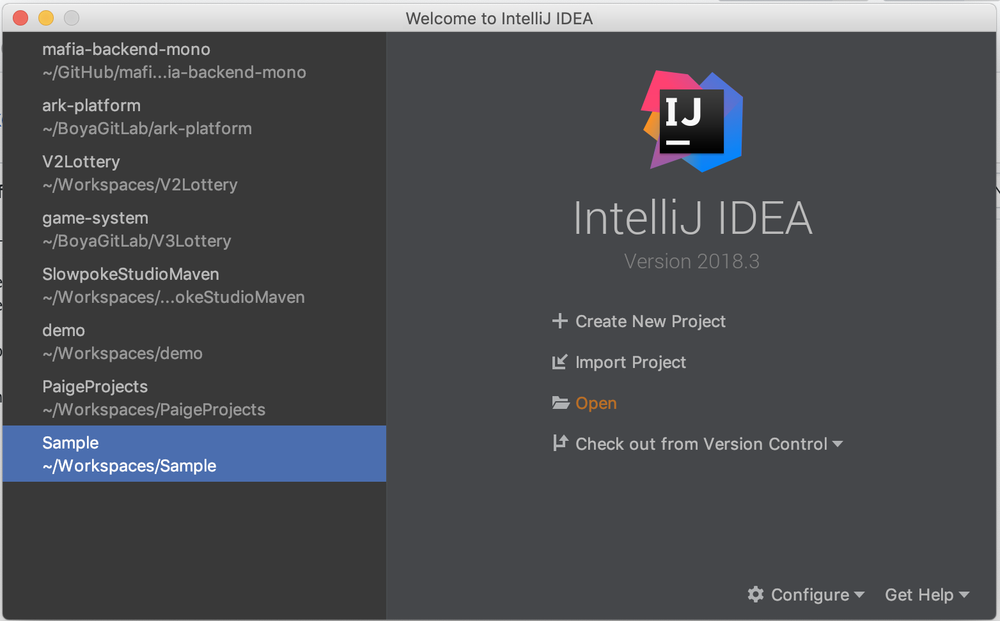
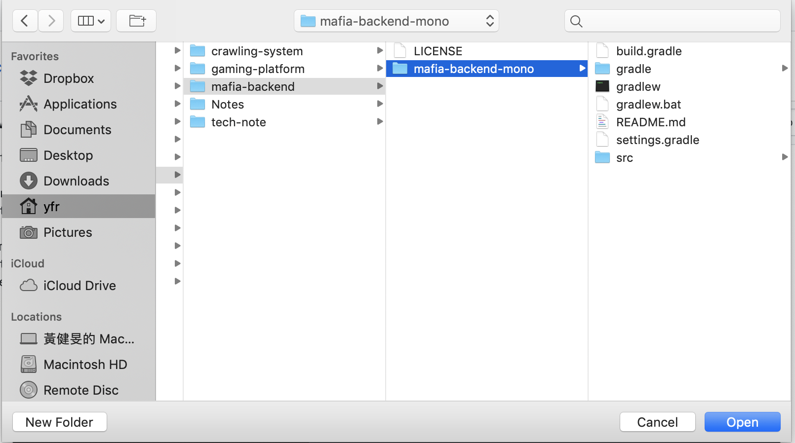
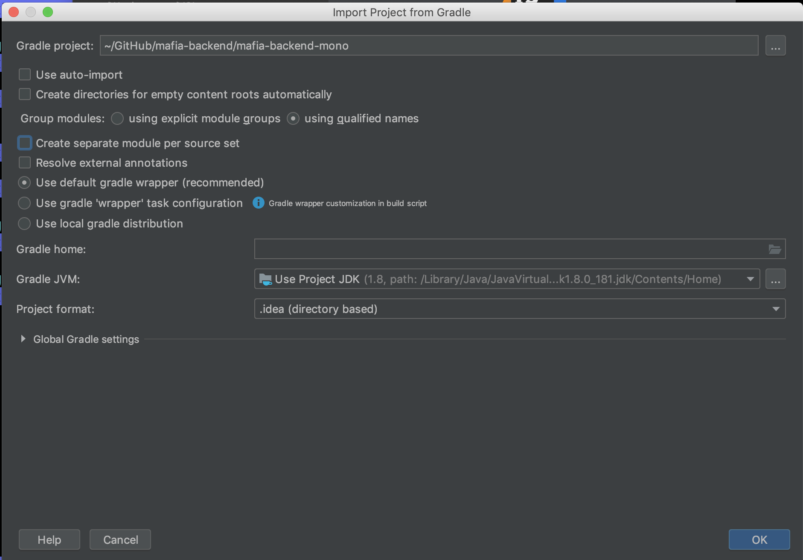

# 🕵️ mafia-backend   

## Prerequisite
* Intellij IDEA

## Import Step
* git clone git@github.com:CommonMarvel/mafia-backend.git
* open the project

* uncheck "Create separate module per source set"

## License
[MIT License][license-page]

Copyright (c) 2019 CommonMarvel

[:arrow_up: back to top][top-page]

[license-page]: <https://github.com/CommonMarvel/mafia-backend/blob/master/LICENSE>
[top-page]: <https://github.com/CommonMarvel/mafia-backend#%EF%B8%8F-mafia-backend--->
